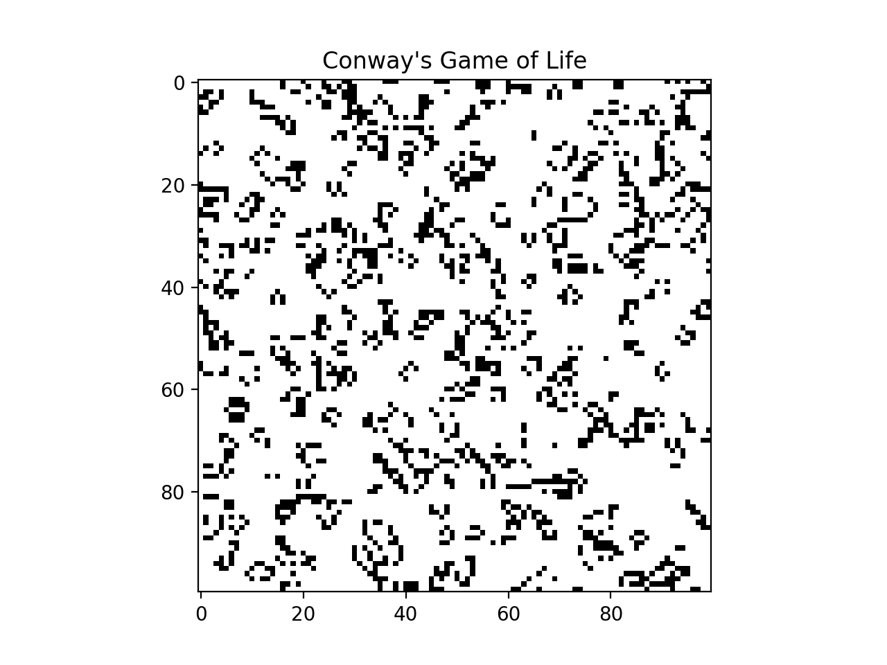
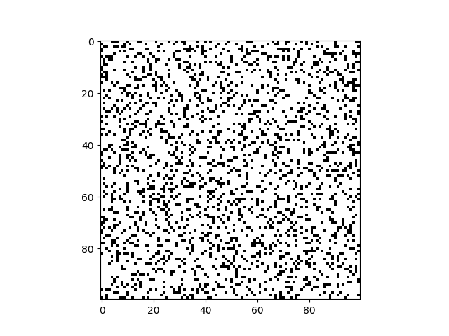

# Game of Life

Conway's Game of Life implemented at three levels of parallelism. All three use the same rules but approach the stencil computation differently. Animated GIFs are in `results/`.

## Implementations

### serial.py — NumPy vectorised
All eight neighbour shifts computed with `np.roll` in a single vectorised pass. Birth and survival rules applied with boolean masks. Produces `game_of_life.gif`.

```bash
python3 serial.py
```



### mpi.py — MPI distributed (mpi4py)
Grid is decomposed row-wise across ranks. Each step:
1. `Sendrecv` exchanges one ghost row with the rank above and below
2. Stencil is applied to the interior (padded) local grid
3. `Gather` assembles the full grid on rank 0 for each animation frame

Rank 0 saves `game_of_life_mpi.gif` after all steps complete.

```bash
mpirun -n 4 python3 mpi.py
```



### numba.py — JIT/NJIT/Stencil benchmarks
Benchmarks four evolution strategies on a 1000x1000 grid for 100 steps:

| Implementation | Notes |
|---|---|
| NumPy slicing | Reference baseline |
| `@jit` loop | Manual nested loops with Numba JIT |
| `@njit(parallel=True)` | Parallel loops with `prange` |
| `@jit(forceobj=True)` slicing | JIT on the NumPy slicing path |
| `@stencil` | Numba stencil decorator |

Each variant includes a warmup call before timing.

```bash
python3 numba.py
```

## Dependencies

```
numpy matplotlib mpi4py numba pillow
```
