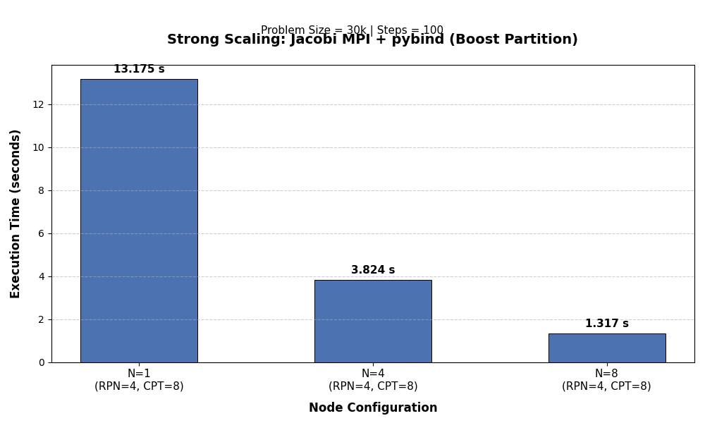
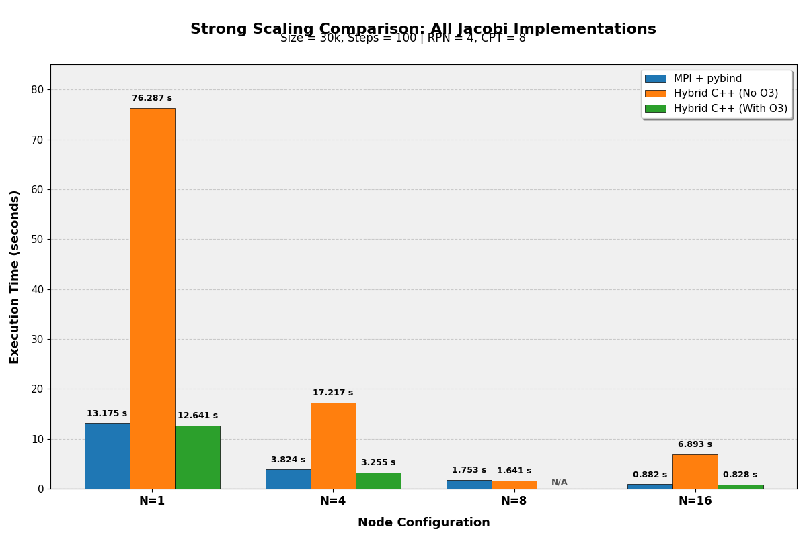

# Jacobi Solver — pybind11 Progression

2D Jacobi heat diffusion solver built as a three-stage progression: serial C++, distributed MPI+OpenMP C++, and GPU CuPy. The C++ versions are compiled as shared libraries and called directly from Python via pybind11. Strong scaling results are from Leonardo Booster (30k grid, 100 steps, 4 ranks/node, 8 threads/rank).

---

## serial

C++ `CMesh` and `CSolver` classes exposed to Python via pybind11. `CMesh` holds the grid as a flat `std::vector<double>` with linear gradient boundary conditions. `CSolver.jacobi()` runs the stencil in-place.

**Build:**
```bash
c++ -O3 -Wall -shared -std=c++11 -fPIC \
    $(python3 -m pybind11 --includes) \
    -undefined dynamic_lookup \
    src/jacobi.cpp -o jacobi$(python3-config --extension-suffix)
```

**Run:**
```bash
python3 main.py
```

---

## parallel

Same solver extended with MPI rank decomposition and OpenMP threading, exposed via pybind11 as `jacobi_mpi`. `CMesh` initialises with `MPI_COMM_WORLD`, each rank owns a row slice. `mesh.jacobi_solver()` handles halo exchange and stencil internally; `jm.print_performance_stats()` gathers timings across ranks.

**Build:**
```bash
# macOS
mpicxx -O3 -Wall -shared -std=c++20 -fPIC \
    $(python3 -m pybind11 --includes) \
    -I/opt/homebrew/opt/libomp/include \
    -L/opt/homebrew/opt/libomp/lib \
    -undefined dynamic_lookup -Xpreprocessor -fopenmp \
    src/mesh.cpp -o jacobi_mpi$(python3-config --extension-suffix) -lomp

# Leonardo
mpicxx -O3 -Wall -shared -std=c++20 -fPIC \
    $(python3 -m pybind11 --includes) \
    src/mesh.cpp -o jacobi_mpi$(python3-config --extension-suffix) -fopenmp
```

**Run:**
```bash
mpirun -np 4 python3 main.py
```

**Strong scaling results (vs native hybrid C++):**

| Nodes | MPI + pybind | C++ hybrid (O3) |
|---|---|---|
| 1 | 13.18 s | 12.64 s |
| 4 | 3.82 s | 3.26 s |
| 16 | 0.88 s | 0.83 s |

pybind overhead is minimal — performance tracks native C++ closely. `plot.py` generates the bar chart comparison in `results/`.





---

## gpu

CuPy implementation — grid lives on GPU as `cp.ndarray`, stencil applied with array slicing directly on device. MPI halo exchange uses CPU staging buffers (`np.zeros`) to avoid CUDA-aware MPI issues. Each rank pins to a unique GPU via `cp.cuda.Device(rank % 4)`.

**Run:**
```bash
# Local
mpirun -n 4 python3 src/main_gpu.py

# Cluster
sbatch batch.sh
```

**Strong scaling results (vs CPU baselines):**

| Nodes | Total tasks | CuPy GPU | MPI + pybind (CPU) |
|---|---|---|---|
| 1 | 4 | 1.57 s | 13.18 s |
| 4 | 16 | 0.46 s | 3.82 s |
| 8 | 32 | 0.30 s | 1.75 s |
| 16 | 64 | 0.25 s | 0.88 s |

GPU is ~8x faster than the CPU pybind version at 1 node, converging as node count increases due to MPI communication overhead. `plot.py` plots all three implementations on a log scale.

---

## Dependencies

- pybind11: `pip install pybind11`
- mpi4py, cupy, numpy, matplotlib
- OpenMPI, libomp
